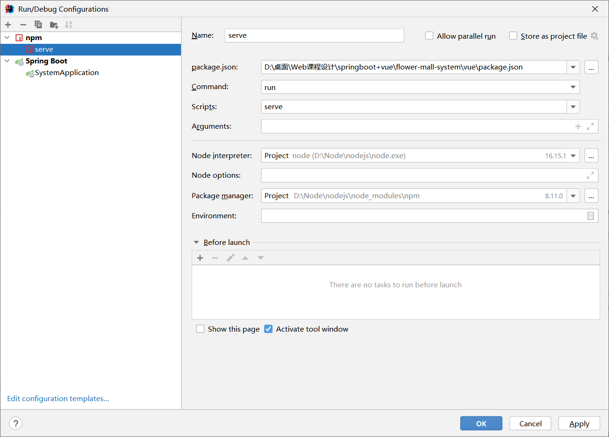

# 花卉商城系统 flower-mall-system
>项目整体分为两部分，即后端system模块和前端vue模块

## 数据库
>本项目中使用的是MySQL数据库，因此项目运行时，需要有数据库的支持，相关配置请在application.yml文件中进行更改。

数据库中需要三个表单，具体信息可自行修改，默认推荐如下（若有错误，请自行修改）：

>user用户信息表:
>```
>
>CREATE TABLE `user` (
>`user_phone`  bigint(255) NOT NULL COMMENT '手机号码' ,
>`nickname`  varchar(255) NULL COMMENT '账号昵称' ,
>`password`  varchar(255) NOT NULL COMMENT '账号密码' ;
>`user_name`  varchar(255) NOT NULL COMMENT '姓名' ,
>`idcard`  varchar(255) NOT NULL COMMENT '身份证号码' ,
>`sex`  varchar(255) NOT NULL COMMENT '性别' ,
>`avatar`  varchar(255) NULL COMMENT '头像' ,
>`signature`  varchar(255) NULL COMMENT '个性签名' ,
>`user_address`  varchar(255) NULL COMMENT '居住地址' ,
>PRIMARY KEY (`phone`)
>)
>COMMENT='用户信息表'
>;

>花卉商品信息表
>```
>CREATE TABLE `floral_product` (
>`id`  bigint NOT NULL AUTO_INCREMENT COMMENT '商品编号' ,
>`product_name`  varchar(63) NOT NULL COMMENT '商品名称' ,
>`product_price`  double(63,2) NOT NULL COMMENT '商品单价' ,
>`sell_state`  varchar(255) NOT NULL DEFAULT 0 COMMENT '上架状态' ,
>`seller_phone`  bigint(63) NOT NULL COMMENT '卖家手机号码' ,
>`product_number`  int(63) NOT NULL COMMENT '商品数量' ,
>`sell_numbe`  int(63) NULL DEFAULT 0 COMMENT '销售数量' ,
>`flower_species`  varchar(63) NULL COMMENT '花卉种类' ,
>`description`  varchar(255) NULL COMMENT '商品说明' ,
>`product_address`  varchar(255) NULL COMMENT '商品产地' ,
>`image1`  varchar(255) NULL COMMENT '商品图片1' ,
>`image2`  varchar(255) NULL COMMENT '商品图片2' ,
>`image3`  varchar(255) NULL COMMENT '商品图片3' ,
>PRIMARY KEY (`id`)
>CONSTRAINT `用户手机号码` FOREIGN KEY (`seller_phone`) REFERENCES `user` (`user_phone`)
>)
>COMMENT='花卉商品信息表'
>;

>花卉订单信息表
>```
>CREATE TABLE `flower_order` (
>`id`  bigint NOT NULL AUTO_INCREMENT COMMENT '订单编号' ,
>`goods_id`  bigint NOT NULL COMMENT '商品编号' ,
>`seller_phone`  bigint NOT NULL COMMENT '卖家手机号码' ,
>`buyer_phone`  bigint NOT NULL COMMENT '买家手机号码' ,
>`sell_number`  int NOT NULL COMMENT '订单数量' ,
>`amount`  double NOT NULL COMMENT '交易金额' ,
>`receive_address`  varchar(255) CHARACTER SET utf8 NOT NULL COMMENT '收货地址' ,
>`order_time`  varchar(255) CHARACTER SET utf8 NOT NULL COMMENT '下单时间' ,
>`delivery_time`  varchar(255) CHARACTER SET utf8 NULL COMMENT '发货时间' ,
>`complete_time`  varchar(255) CHARACTER SET utf8 NULL COMMENT '完成时间' ,
>PRIMARY KEY (`id`),
>FOREIGN KEY (`goods_id`) REFERENCES `goods` (`id`),
>FOREIGN KEY (`seller_number`) REFERENCES `user` (`user_phone`),
>FOREIGN KEY (`buyer_number`) REFERENCES `user` (`user_phone`)
>)
>COMMENT='订单信息表'
>;
>``


## 后端system模块
>后端使用的是spring boot框架，数据库交互使用MyBatis-Plus框架

>默认端口为9090，若需要请在application.yml文件中修改，并且，前端中的vue.config.js文件也要进行响应的修改

>commom文件中放置了公共开发组件
>>CorConfig文件用于配置跨域信息;
> 
>>Result用于返回前端的请求结果

>entity文件放置实体类，和数据库的表相互对应

> controller文件中编写给用户的接口

>**图片文件** 统一放置在 /resources/static/image 文件中，若需要可在 /controller/ImageController 中修改


## 前端vue模块
> 前端使用*Vue框架* 和 *Element UI开发组件*，使用axios进行接口请求；
> 
> 前端整体分为两大部分，即**后台管理页面**和**前台商城页面**
> 
> 前端默认使用的端口为8080，若有需要可在 vue.config.js 文件中进行修改
> 
> **后台管理页面**默认通过 localhost:8080/manage 进行访问；&nbsp;
> **前台商城页面**默认通过 localhost:8080/index 进行访问；
> &nbsp;&nbsp;若需要修改，可在路由配置文件 /router/index.js 中进行设置

> views文件中放置了各个页面；components文件中放置一些公共组件；utils/request.js中进行axios相关配置

###项目启动方法
项目前后端分离，因此需分别启动前后端，前端为npm,如下图所示。后端为springboot,直接启动即可
